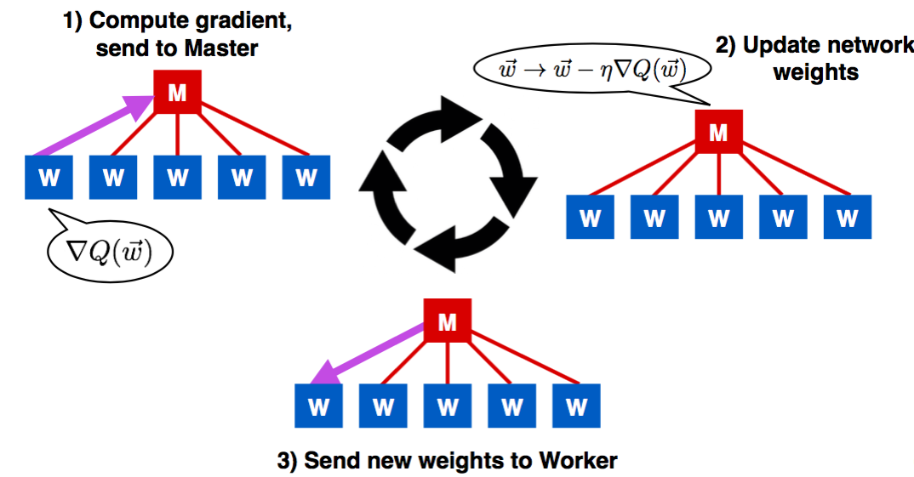

# Neural Network Learning and Optimization : NNLO
Distributed learning with mpi

Dependencies: [`OpenMPI`](https://www.open-mpi.org/) and [`mpi4py`](http://mpi4py.readthedocs.io/en/stable/) (v. >= 2.0.0), [`keras`](https://keras.io/) (v. >= 1.2.0)

Test with the MNIST dataset, with keras+tensorflow
```
git clone https://github.com/vlimant/NNLO.git
cd NNLO

mpirun -np 3 python3 TrainingDriver.py --model example_mnist.py --loss categorical_crossentropy --epochs 3
mpirun -np 3 python3 TrainingDriver.py --model example_mnist_torch.py --loss categorical_crossentropy --epochs 3

mpirun -np 7 python3 OptimizationDriver.py --model example_mnist.py --block-size 3 --epochs 3 --num-iterations 10

```

## Using TrainingDriver.py to train your model

`TrainingDriver.py` will load a keras model of your choice and train it on the input data you provide.  The script has three required arguments:
- Path to JSON file specifying the Keras model (your model can be converted to JSON using the model's `to_json()` method)  
- File containing a list of training data.  This should be a simple text file with one input data file per line.  By default the script expects data stored in HDF5 format; see below for instructions for handling arbitrary input data.
- File containing a list of validation data.  This should be a simple text file with one input data file per line.  

See `TrainingDriver.py` for supported optional arguments.  Run the script via `mpirun` or `mpiexec`.  It automatically detects available NVIDIA GPUs and allocate them among the MPI worker processes.

## Customizing the training process

The provided `TrainingDriver.py` script handles the case of a model that is specified in JSON format and training data that is stored in HDF5 files. However, the construction of the model and the loading of input data are easily customized.  

#### Model

Use the ModelBuilder class to specify how your model should be constructed:
[mpi_learn/train/model.py](mpi_learn/train/model.py)

To specify your model, create a new class deriving from ModelBuilder and override the `build_model()` method.  This method should take no arguments and return the Keras model you wish to train.

Provide an instance of ModelBuilder when you construct the MPIManager object (see below).  At train time, the `build_model` method of the ModelBuilder will be called, constructing the model you specified.  

The provided ModelFromJson class is a specialized ModelBuilder that constructs a model from a JSON file (as produced by the `to_json()` method of a `keras` model).  This is usually the easiest way to specify the model architecture.

#### Training/Testing data 

Use the Data class to specify how batches of training data should be generated:
[mpi_learn/train/data.py](mpi_learn/train/data.py)

To specify your training data, create a new class deriving from Data and override the `generate_data()` method.  The `generate_data` method should act as follows:
- yield batches of training data in the form required for training with Keras, i.e. ( [x1, x2, ...], [y1, y2, ...] )
- stop yielding batches and return after one epoch's worth of training data has been generated.  

Provide an instance of the Data class when you construct the MPIManager (see below).  During training, workers will iterate over the output of the `generate_data` method once per epoch, computing the gradient of the loss function on each batch. 

Note: `generate_data` should not continue to yield training batches forever; rather it should generate one epoch's worth of data before returning.  

#### Optimization Procedure

Use the Algo class to configure the details of the training algorithm:
[mpi_learn/train/algo.py](mpi_learn/train/algo.py)

Provide an instance of the Algo class when you construct the MPIManager (see below).  The Algo constructor takes several arguments that specify aspects of the training process:
- `optimizer`: supported arguments are `'sgd'`, `'adadelta'`, `'rmsprop'`, and `'adam'`.  For optimizers that have tunable parameters, please specify the values of those parameters as additional arguments (see [mpi_learn/train/optimizer.py](mpi_learn/train/optimizer.py) for details on the individual optimizers)
- `loss`: loss function, specified as a string, e.g. 'categorical_crossentropy'
- `validate_every`: number of gradient updates to process before performing validation.  Set to 0 to disable validation.
- `sync_every`: number of batches for workers to process between gradient updates (default 1)

##### Downpour SGD
By default the training is performed using the Downpour SGD algorithm [1].

##### Elastic Averaging SGD
To instead use Elastic Averaging SGD [2], the following additional settings should be provided:
- `mode`: specify `'easgd'`
- `worker_optimizer`: learning algorithm used by individual worker processes
- `elastic_force`, `elastic_lr`, `elastic_momentum`: force, learning rate, and momentum parameters for the EASGD algorithm

##### Gradient Energy Matching
The algorithm proposed in https://arxiv.org/abs/1805.08469 is available. DOCUMENTATION TO BE COMPLETED

### Launching the training process

Training is initiated by an instance of the MPIManager class, which initializes each MPI process as a worker or master and prepares the training procedure.  The MPIManager is constructed using the following ingredients (see TrainingDriver.py for example usage):
- `comm`: MPI communicator object, usually `MPI.COMM_WORLD`
- `data`, `algo`, `model_builder`: instances of the `Data`, `Algo`, and `ModelBuilder` classes (see above).  These three elements determine most of the details of training.
- `num_epochs`: number of training epochs
- `train_list`, `val_list`: lists of inputs files to use for training and validation.  Each MPI process should be able to access any/all of the input files; the MPIManager will split the input files among the available worker processes.
- `callbacks`: list of `keras` callback objects, to be executed by the master process

Other options are available as well: see [mpi_learn/mpi/manager.py](mpi_learn/mpi/manager.py)

### Training algorithm overview

In the default training configuration, one MPI process (process 0) is initialized as 'Master' and all others are initialized as 'Workers'.  The Master and each Worker have a copy of the model to be trained.  Each Worker has access to a subset of the training data.  

During training, a Worker reads one batch of training data and computes the gradient of the loss function on that batch.  The Worker sends the gradient to the Master, which uses it to update its model weights.  The Master sends the updated model weights to the Worker, which then repeats the process with the next batch of training data.  



### Hyper-parameter Optimization

FURTHER DOCUMENTATION TO BE ADDED

### References

[1] Dean et al., Large Scale Distributed Deep Networks.  https://research.google.com/archive/large_deep_networks_nips2012.html.

[2] Zhang et al., Deep Learning with Elastic Averaging SGD.  https://arxiv.org/abs/1412.6651
